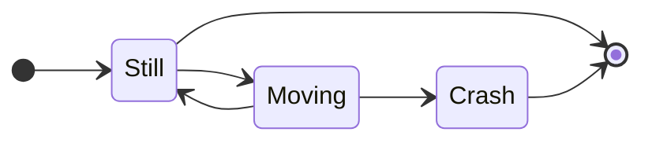

# Regression Testing Mermaid Diagram Import

## A top level Mermaid diagram ^sigil-toc-id-1



## An indented Mermaid diagram ^sigil-toc-id-2

**Note:** the code block below is not rendered correctly in preview mode. Switch to **read** mode to see the syntax highlighting

> ```mermaid
> stateDiagram
>   direction LR
>   [*] --> Still
>   Still --> [*]
> 
>   Still --> Moving
>   Moving --> Still
>   Moving --> Crash
>   Crash --> [*]
> 		
> ```

## Mermaid diagram in a 'pre'


## Mermaid diagram in a codeblock

